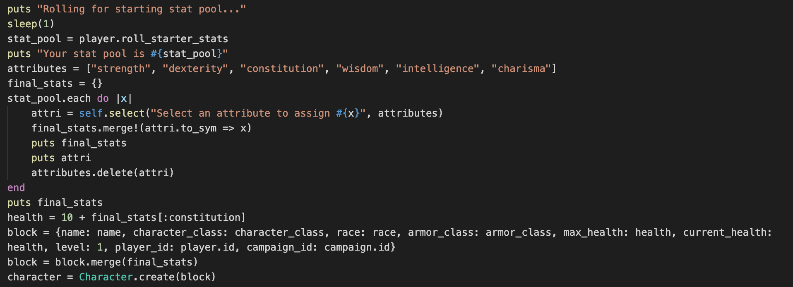
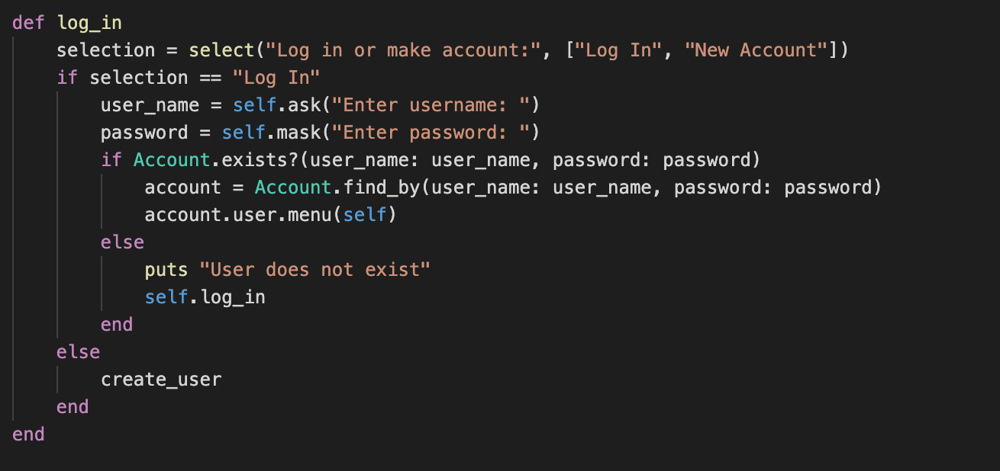
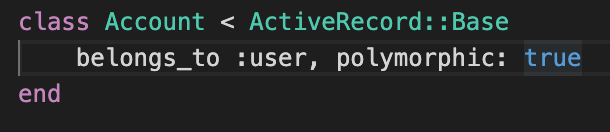
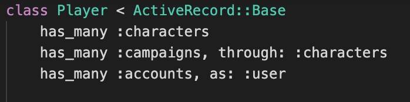
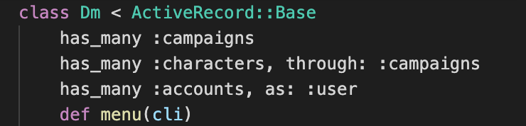
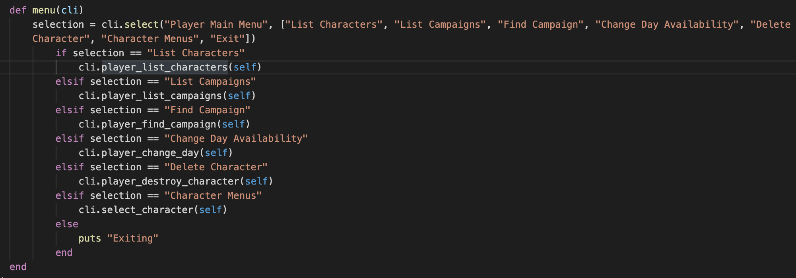

Adventures League D&D Campaign Finder
========================

This app's main function is for players of Dungeons and Dragons to find and link up with dungeon masters and their campaigns, as well as other functions a player or dungeon master(also refered to as a DM) might need.

The purpose of this project was to show as well as expand, explore, and reinforce my skills with the Ruby language and ActiveRecord.

## Tech/Framework Used
* Ruby
* ActiveRecord

# Features
A player user is able to do a lot to manage their characters and find campaigns. They can search for campaigns on their available day, as well as change their day off in order to find more open campaigns. They can make a character for their available campaigns, as well as delete any of their characters. They can also look at a list of either their characters or their campaigns.

With their character the user can look at that charcter's party members, or other characters of players in that campaign with the user. The player can also simulate attacking or healing other members of the party.

On the DM side, the dm can create a new campaign and listing so that players can find his campaign. When the DM does so they set a number as the maximum amount of players they want in there game, as well as the day of the week the game takes place on. The DM can then look at a list of their campaigns, players, and characters.

## How to Use
When the application starts, the user will be greeted with a screen asking them to log in or make a new account. On a new account it'll ask for a username and password, as well as wether they want to make a player or DM account. If the user is logging in, if they give a valid username or password it'll automatically be able to figure out if the account is for a player or DM.

On the player side they'll have mainly explicit options. To make a new character the user first have to find an open  campaign. If the "find campaign" option isnt able to find one for the player's available day it'll return an error message. At which point the player can change their available day and try again. Once they find a campaign, they'll be asked if they want to create a character. At which point the player will name their character, and select qualities for it. The application will then roll a dice to get a pool of stat values that the user will then be able to assign to each attribute as they like.

If they go to the character menu they will have the options to attack or heal other members of the party. Heal will roll dice for a standard health potion in D&D 5th edition rules and then increase that party members current health stat by the result, but not past their max health. If they attack the application will roll a dice that the result of which will be changed according to the characters attributes and then do one of several things:
* If the roll is lower than the targets armor class, the attack will miss and not do damage
* If the roll is, without bonuses, between 2 and 19 and high enough to hit, the application will then roll damage to be dealt to the target
* If the roll is, without bonuses, a 20 the application will roll damage twice and sum the total to deal to the target
* If the roll is, without bonuses, a 1, the application will roll a damage value that the attacker will deal to itself

After any result if any character's health drops to or below zero, the application will roll death saving throw rolls for that character, according to D&D 5th edition rules.

As a DM user, they can create a campaign, setting values according to what kind of game they would like to run. They can then search for players available on the right day who don't currently have a campaign. Once they have players find and join their game, they can look up their players and respective characters.

# Code Examples

Here are a few examples of sections of my code I am proud of.

The above code snipet is how the application lets a player pick which attribute is assigned which value when they create a character. First it runs the player method to roll a starter selection of values. It outputs 6 values ordered from highest to lowest. It then iterates through that array with an array of strings set to the different attributes, and on each iteration it asks the user to select an attribute from a list to assign that value. Once that attribute is selected, it and the stat are shoveled onto a hash as a key value pair, and the attribute string is removed from the array that the user will select from on the next iteration of the stat array.

Once that is completed, the application will combine that newly built hash with another hash made up of key value pairs assigned earlier in the code and then create a character with just that hash.

The above code is near the beginning of my application. If the user is a returning user it checks the username and password to find the corrisponding account, then directs that user to it's main menu. The cool part about it is it's able to tell if the account is a player or a dm account. It does that through the line `account.user.menu(self)`
This is a method included in ActiveRecord that uses a polymorphic relationship, which I didn't even know existed before starting this project. Basically it lets a class like Account, belong_to only one other class, but can belong to diffent types of classes, like an account can belong to either a player, or a dm but only one.

To let ActiveRecord know that that is what I am doing, I gave the class the tag polymorphic: true, and said that it belongs_to  a sort of hidden middle class, User, that does not actually exist in my code.

And then for the other side of the relationship I gave the Player class a has_many relationship to accounts, but as a user.

And then I did the same to DM. What this does is when I run a method over an account.user, it checks *for that account* wether that account belongs to a player or a DM instance and then runs that instance's method. 

So if my account in the code before belonged to a player instance, account.user.menu() translates to account.player.menu() and then runs this code from the player class. This is important because on a different running of the same code if it's a DM instance instaid it'll take them to the dm method of the same name, menu(), instead. This lets me shorten the amount of code away from what I had before, and if else statement. Including a polymorphic relationship let me refactor here, and in other places in my code way more than I originally thought it would.

# Wrap Up
I had a lot of fun on this project, and working with this let me enforce what I knew and really learn and incorporate more concepts. I'm really looking forward to learning more.