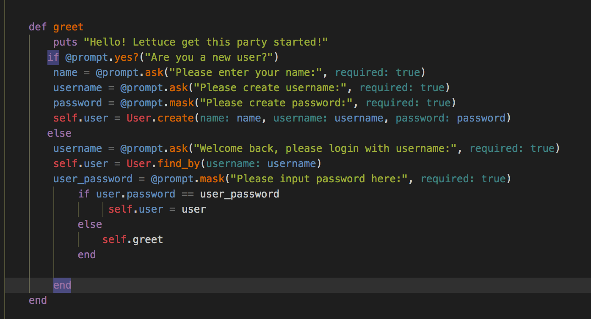
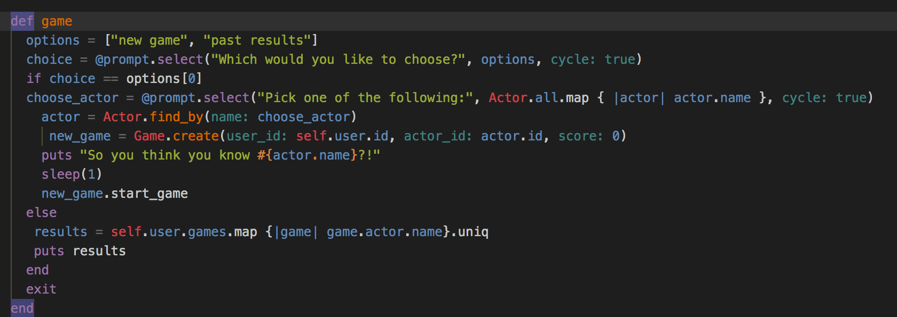

Module One Final Project: QuoteMe
========================

QuoteMe is a CLI app that allows a user to create/login into an account and participate on quizzes with actors they think they know. By selecting an actor you want to be quizzed on, the game then throws out random quotes from that actor's work and asks you to choose where it comes from. If a user gets a perfect score, they should be able to add that actor's name to their profile.

========================

For my first project, I wanted to make an enjoyable game from something that I'm passionate about. Since I'm a huge movie/tv buff, I'm always throwing out random movie quotes in conversations with my friends. It was then, I decided I'd make a little game out of it.

========================

Built With: Ruby
Built With: ActiveRecord

Installed TTY::Prompt

========================

greet method is where the user will create/login account

game method will create a new game based on the actor you chose, then take you to the start of the game.

========================

